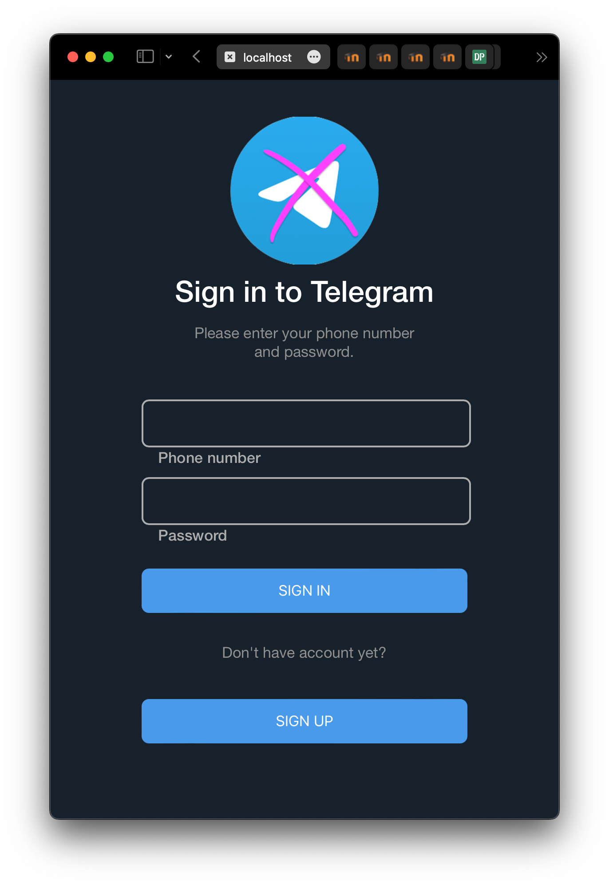
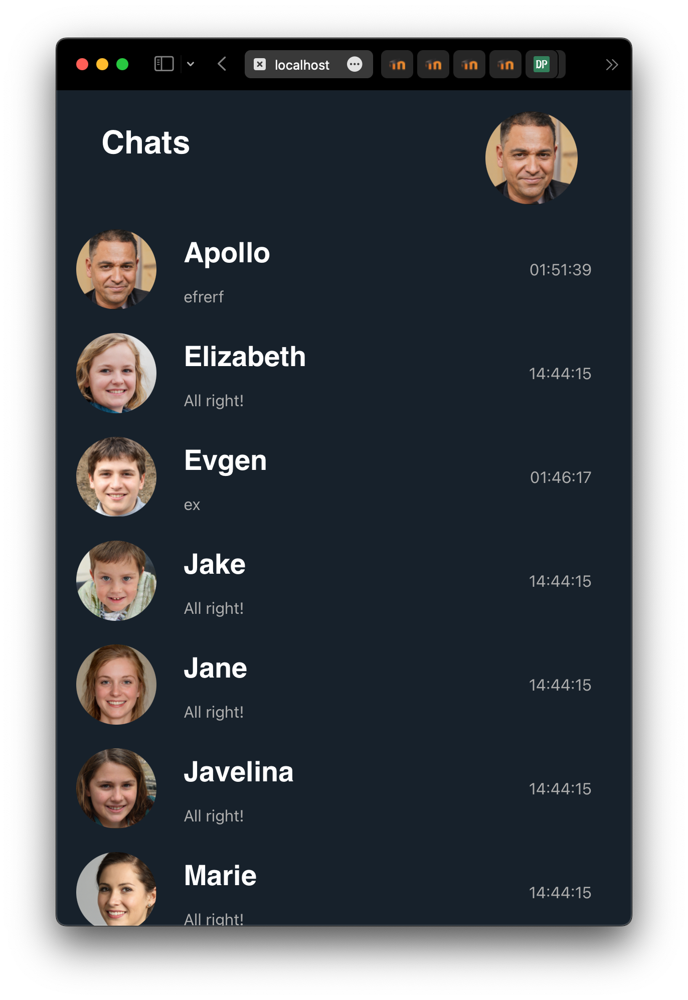
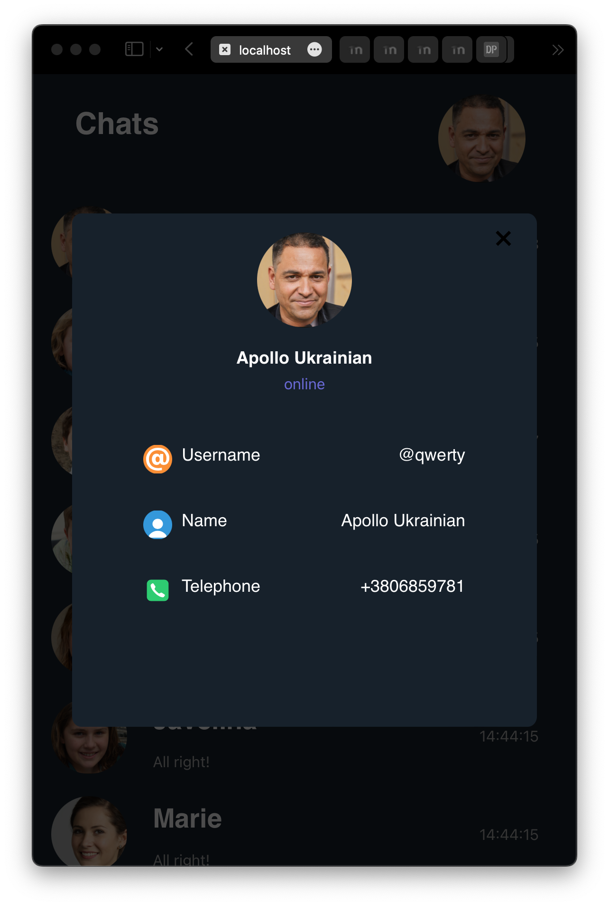
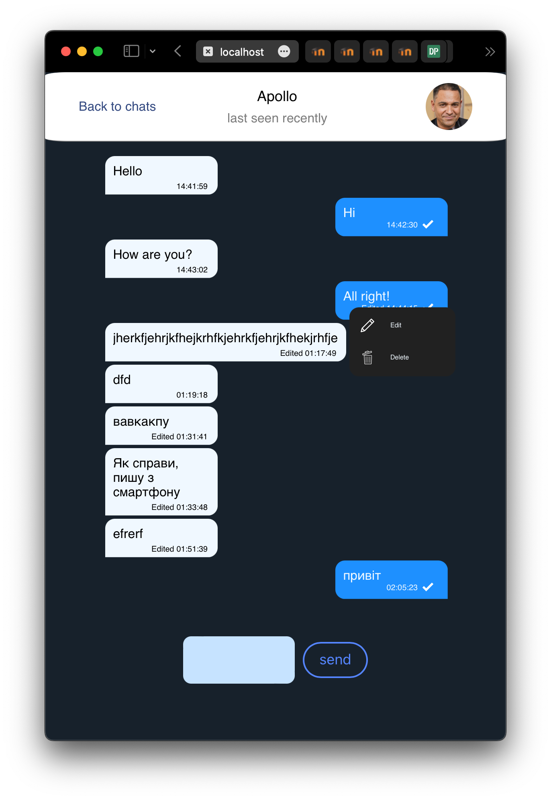

# TheMessenger

## About
An online messenger based on React with realtime chat conversations.


## Requirements
* Node.js
* npm

## Installation
1. Clone this repository
2. Open directory of the messenger
3. Run
   ```
   npm install react-scripts --save
   ```
4. Run 
    ```
    npm start
    ```

## Implemented:
- [x] Raised server on JS
- [x] User profile information
- [x] Sign up/in windows
- [x] Chats list
- [x] Messages
- [x] Deletion and edition of sent messages

### Examples





